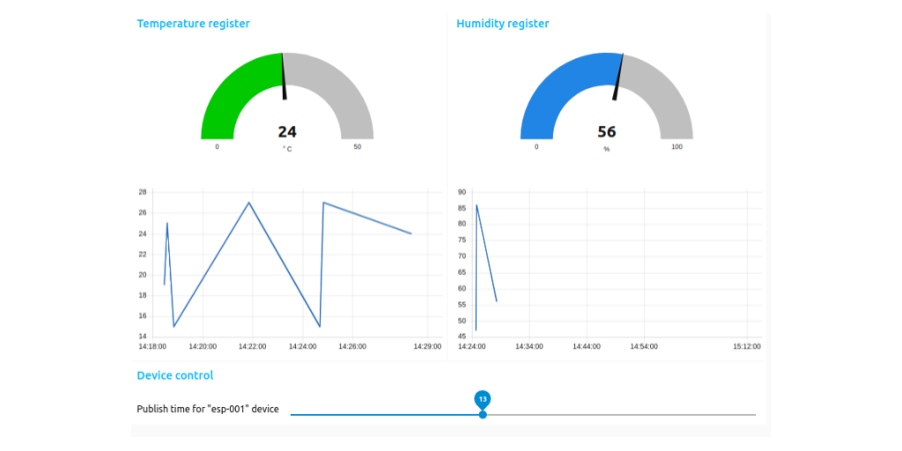

# Nodes connection

Author: Agustin Bassi - 2020

## 
## Table of Contents


* [Introduction](#introduction)
* [Install dependencies](#install-dependencies)
* [Run the application](#run-the-application)
* [Test the application](#test-the-application)
* [Want to help?](#want-to-help-?)
* [License](#license)

## Introduction

This project is an IoT multiprotocol dashboard based in Node-RED and running using Docker Compose.

The platform consists in several modules described below.

* **Node-RED App**: Node-RED is a platform to easily develop IoT application based in a powerful visual programming blocks. The dashboard is created using Node-RED as base.
* **MQTT Broker**: The Mosquitto broker running into the application is used to receive messages from remote device and visualize this information into the dashboard. Besides it is used to send messages from dashboard to device.
* **MQTT Device** (optional): An embedded application that runs in any platform with Wifi & MQTT support which sends measurments of humidity and temperature periodically to visualize them in the dashboard. This piece of the project because the dashboard can works without it. More details in its [README file](https://github.com/agustinBassi/nodes-connection-mqtt-device).

All of this parts are well described in the [Project Wiki](https://github.com/agustinBassi/nodes-connection/wiki). Please, refer to it in order to get all required information.

In the figure below there is a description of the full application modules and how they interact each others.


## Install dependencies


The application runs over Raspberry Pi 3+. To install Raspberry Pi OS refer to [official documentation](https://www.raspberrypi.org/documentation/installation/installing-images/).

The platform needs the next dependencies.

* Docker & Docker-Compose (installation steps in [this link](https://devdojo.com/bobbyiliev/how-to-install-docker-and-docker-compose-on-raspberry-pi)).

_Although the application is designed to run on a Raspberry Pi 3+, it can runs on any system with Docker & Docker Compose installed. Docker installation steps in [official documentation](https://docs.docker.com/get-docker/). Docker-Compose installation steps in [official documentation](https://docs.docker.com/compose/install/)._

## Run the application

Once dependencies are installed in the Raspberry Pi do the next steps.

1. Download the platform code (this repository) with the next command.

```
git clone https://github.com/agustinBassi/nodes-connection.git
cd nodes-connection/
```

2. Start the application with the next command.

```
docker-compose up
```

3. Go to application's dashboard opening [http://host_ip:1880/ui](http://host_ip:1880/ui) in the web browser. You should see a dashboard like below.




## Test the application

The dashboard have two-ways communication: from devices to dashboard & from dashboard to devices.

### From Devices to dashboard

Once the Node-RED dashboard is running (previous step), publish a message using the mosquitto_pub client which are bundled into the Mosquitto Docker container with the next command:

```sh
docker exec -it mosquitto mosquitto_pub -t "device/status/esp32-001" -m '{"temperature": 19, "humidity": 77}'
```

After the MQTT topic is published, the values must be shown in the dashboard. Publish other values to see them in the chart widgets. 

### From Dashboard to devices

To test the communication from dashboard to devices, subscribe to any topic using mosquitto_sub client bundled into Mosquitto Docker container with the next command.

```sh
docker exec -it mosquitto mosquitto_sub -t "#"
```

Then, in the `MQTT Messages` section in the dashboard, set a topic to send, a message and press `Publish`. The content of the message should be shown into the terminal where the mosquitto_sub command was executed.


## Want to help?

Pull requests are welcome. For major changes, please open an issue first to discuss what you would like to change.

If someone want to helpme, every bit of effort will be appreciated. In [this link](https://github.com/agustinBassi/nodes-connection/projects/1) there is the project status board. You can take any card you want (or propose one) from the ToDo list and start to work.

If you find it useful please helpme following my Github user and give to this project a Star. This will animate me to continue contribuiting with the great open source community.

## License

This project is licensed under the GPLV3 License.

