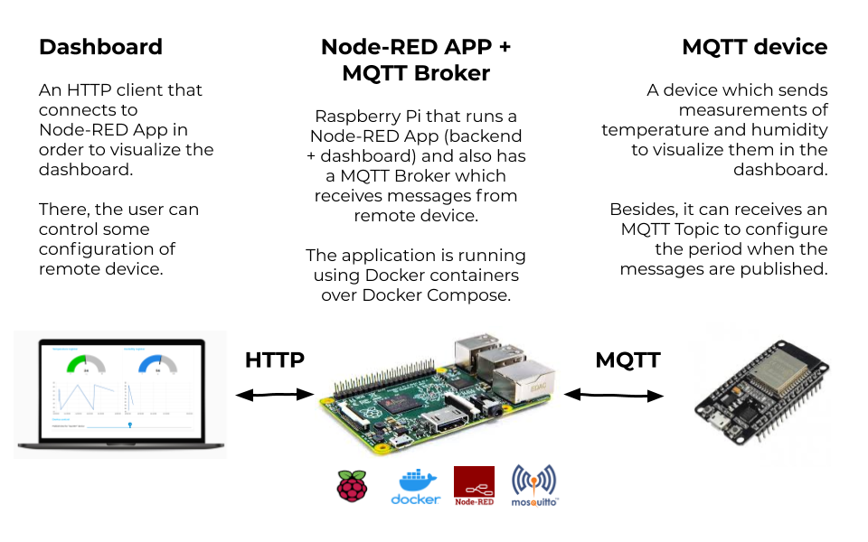
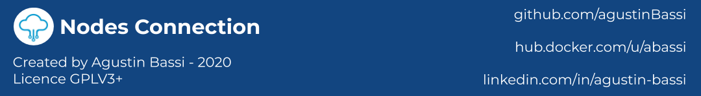

# Open source IoT Multiprotocol Dashboard Application using Docker COmpose

Author: Agustin Bassi - 2020

## 
## Table of Contents


* [Platform Introduction](#platform-introduction)
* [Install dependencies](#install-dependencies)
* [Run the application](#run-the-application)
* [Test the application](#test-the-application)
* [Run mqtt-client-arduino (optional)](#run-mqtt-client-arduino-(optional))
* [Want to help?](#want-to-help-?)
* [License](#license)

## 
## Platform Description

The goal of this project is ...

The platform consists in several modules described below.

* **MQTT Broker**: Raspberry Pi that runs a MQTT Broker to interact with the HTTP client via WebSockets and to MQTT clients via MQTT protocol. Besides, has a HTTP server in order to serve the page of the HTTP Client.

In the figure below there is a description of the application modules and how they interact each others.



## 
## Install dependencies


The application runs over Raspberry Pi 3+. To install Raspberry Pi OS refer to [official documentation](https://www.raspberrypi.org/documentation/installation/installing-images/).

The platform needs the next dependencies.

* Docker & Docker-Compose (installation steps in [this link](https://devdojo.com/bobbyiliev/how-to-install-docker-and-docker-compose-on-raspberry-pi)).

_Although the application is designed to run on a Raspberry Pi 3+, it can runs on any system with Docker & Docker Compose installed. Docker installation steps in [official documentation](https://docs.docker.com/get-docker/). Docker-Compose installation steps in [official documentation](https://docs.docker.com/compose/install/)._

## 
## Run the application

Once dependencies are installed in the Raspberry Pi do the next steps.

1. Download the platform code (this repository) with the next command.

```
git clone https://github.com/agustinBassi/nodes-connection.git
cd nodes-connection/
```

2. Start the application with the next command.

```
docker-compose up
```

3. Go to application's dashboard opening [http://host_ip:5001/](http://host_ip:5001/) in the web browser.

## 
## Test the application

To easily test if application is running correctly the `mqtt-client-web` application must be running in the browser. Put the MQTT host IP in the field `MQTT host` and press the button `CONNECT` to connect to broker and then `SUBSCRIBE` to all topics set by default. The `Information & Logs` section will show actions performed.

Once the client is correctly connected to the broker, the next step is to connect via SSH with the Raspberry where the MQTT broker is running (avoid this step if the MQTT broker is running locally).

Within MQTT host, send a test topic->payload from the tool `mosquitto_pub` installed into `mosquitto` container. Execute the command below.

```sh
docker exec -it mosquitto mosquitto_pub -t "mq-connection/cli-topic" -m "test-payload"
```

In the web client the topic->payload pair must be shown.

## 
## Useful commands


#ejecutar el container de node red con la interfaz de red del host
```sh
docker run \
-it \
-p 1880:1880 \
-v /home/juan.bassi/personalProjects/docker/node-red/node-modules:/data \
--name node-red \
--network host \
nodered/node-red-docker
```

Ejecutar el container de mosquitto con la interfaz de red del host.

```sh
docker run -it -p 1883:1883 -p 9001:9001 --network host eclipse-mosquitto
```

Ejecutar el container de maria-db con la interfaz de red del host.

```sh
docker run \
--name mariadb \
-e MYSQL_ROOT_PASSWORD=root_pass \
-d \
--network host \
mariadb:latest
```

Ejecutar PHP ADMIN
```sh
docker run \
--name phpadmin \
-it \
--network host \
-e PMA_HOST=localhost \
-e PMA_PORT=3306 \
-e PMA_USER=root \
-e PMA_PASSWORD=root_pass \
-p 8080:80 \
phpmyadmin/phpmyadmin
```

Ejecuta postgress en el puerto 5432.

```sh
docker run --name postgres -e POSTGRES_PASSWORD=root_pass -d postgres
docker run --name phpadmin --link postgres:postgres -it phpmyadmin/phpmyadmin
```


## 
## Want to help?

Pull requests are welcome. For major changes, please open an issue first to discuss what you would like to change.

If someone want to helpme, every bit of effort will be appreciated. In [this link](https://github.com/agustinBassi/mq-connection/projects/1) there is the project status board. You can take any card you want (or propose one) from the ToDo list and start to work.

If you find it useful please helpme following my Github user and give to this project a Star. This will animate me to continue contribuiting with the great open source community.

## 
## License

This project is licensed under the GPLV3 License.

